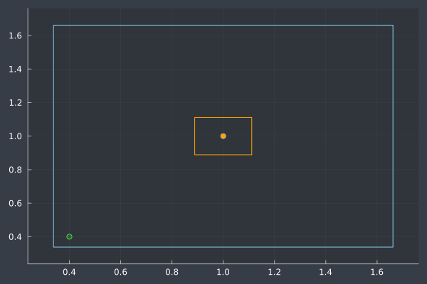

# Estimación de la cuenca o vasija de atracción para el flujo de carga en redes de distribución

En este script se muestran diferentes ejemplos en donde se estima la vasija de atracción en redes de distribución

* Ejemplo A: red de distribución en DC
* Ejemplo B: red trifásica en AC con diferentes puntos iniciales
* Ejemplo C: simulación cuasi-dinámica

---
## Contacto

Alejandro Garcés Ruiz
(https://github.com/alejandrogarces)

## Licencia

## cita

    @misc{GitHubAgarces,
    author={Alejandro Garces-Ruiz},
    title={GitHub repository estimation basin of atraction},
    year={2024},
    url={https://github.com/alejandrogarces/JuliaScripts/tree/562de4c48f8ea450ce13371b3ba6263783729a47/BasinOfAttraction}
