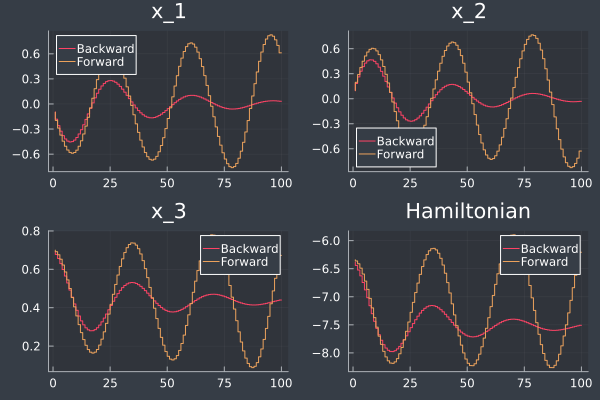

# Ejemplos de sistemas Hamiltonianos controlados por puertos en forma discreta

## Two_area.jl

Sistema de potencia de dos áreas representadas por el modelo de segundo orden de la máquina síncrona.

## HVDC.jl

Modelo simplificado de una línea HVDC con el método de voltaje marginal

## Microgrid.jl

Modelo simplificado de una microrred con tres recursos basados en inversores

---
## Contacto

Alejandro Garcés Ruiz
(https://github.com/alejandrogarces)

## Licencia

