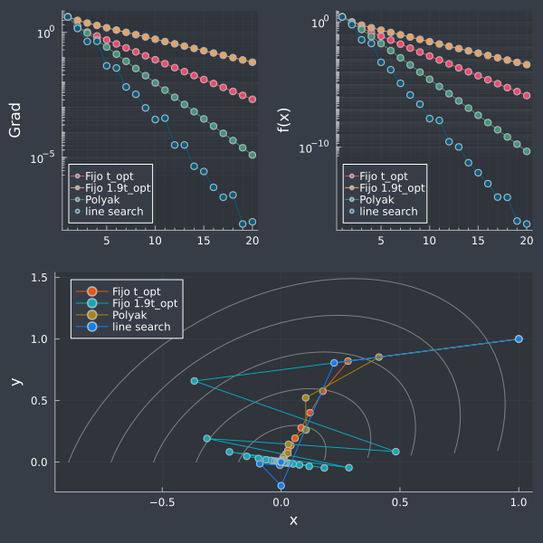

# Método del gradiente

## Resumen

Este simple script muestra diferentes versiones del método del gradiente para una forma cuadrática.
Se supone que la forma cuadratica es convexa $$\mu$$-fuertemente con gradiente $$\gamma$$-Lipschitz.  Bajo estas condiciones el paso óptimo es:

$$ t_p = \frac{\mu}{\gamma^2} $$

El método converge para valores tales que $$ 0 < t < 2t_p$$.    Puede notarse el comportamiento zizagueante cuando el paso se aleja de su valor óptimo.

Se presenta igualmente el paso de Polyak y un método de paso variable.

---
## Contacto

Alejandro Garcés Ruiz
(https://github.com/alejandrogarces)

## Licencia

