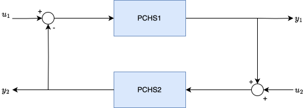

# Operations with Port-Controlled Hamiltonian Systems

## Parallel connection (S1+S2)

The parallel interconnection of two PCHS resuts in a new PCHS.  By parallel interconnection we means the following:

where the input is the same for PCHS1 and PCHS, and the output is the sum $y_1+y2$.  Both, the input and the output must be the same size.  JuPCHS has overloaded the operator + to make this operation, so given two port-controlled Hamiltonian Systems, S1 and S2, we obtain a new PCHS as follows:

    S3 = S1 + S2

The new PCHS makes all the changes and definitions required to obtain a new port-controlled hamiltonian system, namely:

* The vector of state variables increases in size, as $x = [x_1;x_2]$ and $n_{x3} = n_{x1} + n_{x2}$.

* Inputs and outputs remain equal, i.e., $n_{u3} = n_{u1} = n_{u2}$.

* The new Hamiltonian is the sum of the Hamiltonians:  $H_3:\mathbb{R}^n\rightarrow\mathbb{R}$, such that, $H_3(x) = H_1(x) + H_2(x)$

* The gradient of the Hamiltonian is sum of gradients:
$\nabla H_3(x) = \nabla H_1(x) + \nabla H_2(x)$

* Interconnection and damping functions are block matrix-functions:

$J_3(x) = \left(\begin{array}{cc} J_1(x_1) & 0 \\ 0 & J_2(x_2)\end{array} \right)$

$R_3(x) = \left(\begin{array}{cc} R_1(x_1) & 0 \\ 0 & R_2(x_2)\end{array} \right)$

* Input matrix $G$ is also a block matrix

$G_3(x) = \left(\begin{array}{c} G_1(x_1) \\ G_2(x_2)\end{array} \right)$

* Labels are inherited from both S1 and S2, giving priority to the labels in S1.

## Integer multiplication (n*S)

Parallel connection was overloaded with the command +.  So, it results natural to overload the operation $n*S$, where $n$ is an integer and $S$ a PCHS.  For example:

    Snew =  2*S1

Is equivalent to the parallel interconnection of S1 with a copy of S1, namely

    Snew = S1 + S1

## Feedback connection (S1*S2)

Feedback interconection is another operation that preserves the structure of port-controlled Hamiltonian system.  A feedback interconnection is schematically presented below: 

JuPCHS allows feedback interconnection by using the operation *, namely:

    S3 = S1 * S2

Likewise parallel interconnection, the number of inputs/outputs must be the same in both systems.  JuPCHS returns a new port-controlled Hamiltonian system where: 

* The vector of state variables increases in size, as $x = [x_1;x_2]$ and $n_{x3} = n_{x1} + n_{x2}$.

* Inputs and outputs remain equal, i.e., $n_{u3} = n_{u1} = n_{u2}$.

* The new Hamiltonian is the sum of the Hamiltonians:  $H_3:\mathbb{R}^n\rightarrow\mathbb{R}$, such that, $H_3(x) = H_1(x) + H_2(x)$

* The gradient of the Hamiltonian is sum of gradients:
$\nabla H_3(x) = \nabla H_1(x) + \nabla H_2(x)$

* Interconnection and damping functions are block matrix-functions (notice J is different from the case of parallel connection):

$$J_3(x) = \left(\begin{array}{cc} J_1(x_1) & -G_1G_2^\top \\ G_2G_1^\top & J_2(x_2)\end{array} \right)$$

$$R_3(x) = \left(\begin{array}{cc} R_1(x_1) & 0 \\ 0 & R_2(x_2)\end{array} \right)$$

* Input matrix $G$ is also a block matrix (notice it is different from the case of parallel connection):

$$G_3(x) = \left(\begin{array}{cc} G_1(x_1) & 0 \\ 0 & G_2(x_2)\end{array} \right)$$

* Labels are inherited from both S1 and S2, giving priority to the labels in S1.

## Manual

* [Defining PCHS](CH01.md)
* [Interconnecting PHCS](CH02.md)
* [Simulating PCHS](CH03.md)
* [Analyzing PCHS](CH04.md)
* [Examples](CH05.md)
* [List of functions](CH06.md)

---
Back: [Defining PCHS](CH01.md)
Next: [Simulating PCHS](CH03.md)
