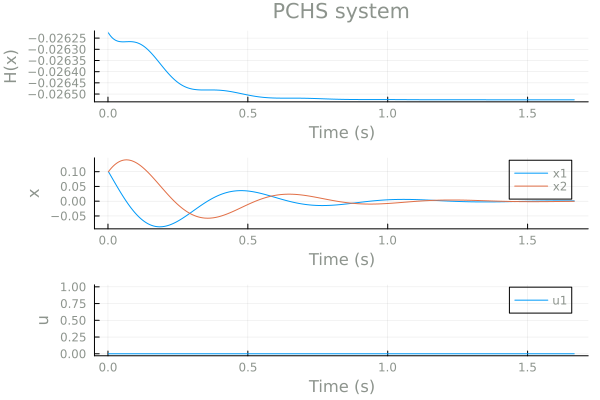

# Simulating Port-Controlled Hamiltonian Systems

JuPCHS simulates the port-controlled Hamiltonian system by using different numerical methods.  The main function for simulation is the following:

    function Simulate(PCHS,u,xini,nt,method)

Where PCHS is the port-controlled Hamiltonian system, u is the input, xini the initial conditions, nt the number of points for the simulation, and, method is the algorithm for solving the ordinary differential equations.  The only parameter required for simulation is PCHS, for instance:

    data = Simulate(PCHS=S1)

returns a dataframe named **data** with the simulation for the port-controlled Hamiltonian system S1.  JuPCHS assumes the following default values:

* u = 0
* xini = [0, ..., 0]
* nt = 500
* method = "Euler"

These parameters can be modified, for example, 

    data = Simulate(PCHS=S1, nt=1000, method="RungeKutta")

simulates the system with 1000 point, using the Runge-Kutta method.  The result is a DataFrame that include inputs, state, output and Hamiltonian.  For example:

    println(data)

returs the following output for the single-machine infinite bus case (see example [SMIB](EX01.md)).

| Row | t | H | x_ω  | x_δ  | p_mec | 
|---|---|---|---|---|---|
|---|---|---|---|---|---|
|---|---|---|---|---|---|
|---|---|---|---|---|---|

The values of xlabel, ulabel and, ylabel are used for each column in the Data Frame.

The default function for ploting is **PlotResults** which requires as inputs, the port-controlled Hamiltonian system (PCHS) and the DataFrame, namely:

    PlotResults(PCHS=S1,data=data)

We present an example of the output below:

Different methods for solving the ordinary differential equation are available, as described below:

## Backward Euler

$x^{+} = x + \tau (J(x)-R(x))\nabla H(x) + G(x)u(x,t)$

## Implicit Euler

$x^{+} = x + \tau (J(x^+)-R(x^+))\nabla H(x^+) + G(x^+)u(x^+,t+\tau)$

## MidPoint

$x^{+} = x + \tau (J(x_m)-R(x_m))\nabla H(x_m) + G(x_m)u(x_m,t+\tau/2)$

with,

$x_m = (x+x^+)/2$

## Runge-Kuta

$f(x) = (J(x)-R(x))\nabla H(x) + G(x)u(x,t)$

$f_1 = f(x)$

$f_2 = f(x+\tau f_1/2)$

$f_3 = f(x+\tau f_2/2)$

$f_4 = f(x+\tau f_3)$

$x^{+} = x + \frac{\tau}{6} (f_1 + 2f_2 + 2f_3 + f_4)$

## Manual

* [Defining PCHS](CH01.md)
* [Interconnecting PHCS](CH02.md)
* [Simulating PCHS](CH03.md)
* [Analyzing PCHS](CH04.md)
* [Examples](CH05.md)
* [List of functions](CH06.md)

---
Back: [Interconnecting PHCS](CH02.md)
Next: [Analyzing PCHS](CH04.md)
