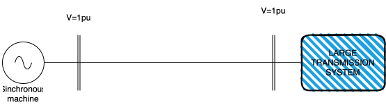

Examples of port-controlled Hamiltonian Systems
## Syncrhonous Machine Connected to an Infinity Bus

A single sinchronous machine connected to an infinite bus can be represented as follows:

$$M \Delta\dot{\omega} = p_m-p_e-\xi \Delta\omega$$

$$\dot{\delta} = \omega_B\Delta\omega$$

where: $M$ is the inertia constant (in s), $\omega_B$ the nominal frequency (e.g., $120\pi$ for Mexico/Colombia, $100\pi$ for Germany/Norway), $p_m$ the mechanical power, $p_e=p_\text{max}\sin(\delta)$ the electrical power, $\xi$ the damping, $\Delta\omega$ the frequency deviation in per-unit, and $\delta$ the angle in radians.

The dynamics of this system can be written under the framework of JuPCHS by defining state variables: $x=[x_\omega,x_\delta]$ with $x_\omega=M\omega$ and $x_\delta = \delta$.  The Hamiltonian is defined as follows:
​
 
$$H(x) = \frac{1}{2M}x_\omega^2 - \frac{p_\text{max}}{\omega_B}\cos(x_\delta)$$

And, the gradient is:

$$\nabla H(x) = [{x_\omega}/{M}, \; p_\text{max}\sin(x_\delta)/\omega_B ]^\top$$

The system has a strict minumum at $[0,0]^\top$.  After simple replacement, we obtain a port-controlled Hamiltonian representation of the dynamics of this system:

$$\dot{x} = (J(x)-R(x))\nabla H(x) + G(x) u(x)$$

$$y = G(x)^\top \nabla H(x)$$

with $J,R,G$ constant matrices:

$$J=\left(\begin{array}{cc} 0 & -\omega_B \\ \omega_B & 0\end{array}\right)$$

$$R=\left(\begin{array}{cc} \xi & 0 \\ 0 & 0\end{array}\right)$$

$$G=\left(\begin{array}{c} 1 \\ 0 \end{array}\right)$$

We only require to define $J$,$G$,$H$ and $\nabla H$ as given below:

    include("scr/JuPCHS.jl")
    using .JuPCHS    
    Ms = 30
    wB = 2*pi*60
    pmax = 10
    Js = [0 -wB; wB 0]
    Gs = [1;0]
    Hs(x) = 1/(2*Ms)*x[1]^2-pmax/wB*cos(x[2])
    dHs(x) = [x[1]/Ms; pmax/wB*sin(x[2])]
    SMIB = BuildPCHS(nx=2,nu=1,dt=1/60/10,J=Js,G=Gs,H=Hs,dH=dHs)
The command **BuildPCHS** requires the number of state varibles (nx), number of inputs (nu), discretization time (dt), interconnection matrix (J), damping (R), Hamiltonian (H) and, Hamiltonian's Gradient (dH).  In this case, we assumed $\xi$ and hence, $R$ was not necessary in the definition.  

We might also include labels for the states (xlabel), inputs (ulabel), outputs (ylabel) and the model itself(name).

    SMIB = BuildPCHS(nx=2,nu=1, dt=1/60/10, J=Js, R=Rs, H=Hs, dH=dHs, name="SingleMachine",xlabel=["x_ω","x_δ"],ulabel=["p_mec"])

JuPCHS has default values for each of these labels.  Hence, they are not required for the correct defintion of the model.  By printing the variable, we can see the effect of these labels:

    println(SMIB)

The following output is expected:

    📌 SingleMachine (Port Controlled Hamiltonian System)
        x' = (J(x)-R(x))∇H(x) + G(x)u(x)
    State variables:        [x_ω, x_δ]
    Inputs:                 [p_mec]
    Outputs:                [y1]
    Discretization time:    0.00166

Simulating the system for an input $u=0$ is as simple as calling the function **Simulate** and include the method for solving the differential equation (method), number of point (nt), and initial conditions (xini).  JuPCHS has default values of nt=500 and xini=0.   

    results = Simulate(PCHS=SMIB,xini=[0.1;0.1],method="MidPoint")
    PlotResults(PCHS=SMIB,data=results) 

In this case, the ordinary differential equation was solved using the MidPoint method. The function uses the forward Euler method unless otherwise specified. It is also possible to simulate the system with a constant input, for example, $u=5$:

    results = Simulate(PCHS=SMIB,nt=5000,xini=[0.1;0.1],u=[5],method="MidPoint")
    PlotResults(PCHS=SMIB,data=results)

A function depending on the time and/or the states is also a valid option, namely:    

    u_input(x,t) = [3*Heaviside(t-4)+5]
    results = Simulate(PCHS=SMIB,nt=5000,xini=[0.1;0.1],u=u_input,method="MidPoint")
    PlotResults(PCHS=SMIB,data=results)    

In the latter, the input is a step function that goes from $u=5$ to $u=8$ at the time $t=4$ seconds. The function Heaviside is just the Heaviside step function (a.k.a., the unit step function).

## Effect of the speed governor

A simple speed governor with droop control and a linearized model of the turbine, can be represented by the following model:

$$\tau\dot{z} = -z + \kappa u$$,

which can be represented as one-dimentional port-controlled Hamiltonian system with $x_T = \tau z$, $R=1$, $J=0$, $G=\kappa$, and Hamiltonian:

$$H(x_T) = \frac{1}{2\tau}x_T^2$$

The output is $y=\kappa (x_T/\tau) = p_\text{mec}$.  The corresponding PCHS is defined below, for $\kappa=1$ and $\tau=2.5$:

    tau = 2.5
    kappa = 1
    Ht(x) = 1/(2*tau)*x[1]^2
    dHt(x) = x[1]/(tau)
    GOV = BuildPCHS(nx=1,nu=1, dt=1/60/10, 
    R=1, H=Ht, dH=dHt,G=kappa,
    name="Speed Governor")

JuPCHS allows the feedback interconnection of port-controlled Hamiltonian system.  

We can use the operation * to repressent feedback interconnection, as follows:

    S = SMIB*GOV
    println(S)

This simple operation creates a new PCHS, named S which corresponds to the feedback interconnection of SMIB and GOV.  JuPCHS takes care of the correct size for the new matrices $J$, $R$, $G$, the Hamiltonian $H$ and the inputs and outputs.  To evaluate the effect of the speed governor, we use the following code:

    u_in(x,t) = [-2*x[1];3*Heaviside(t-1)]
    results = Simulate(PCHS=S,nt=5000,u=u_in,method="MidPoint")
    PlotResults(PCHS=S,data=results)

In this case, the input include a reference for the mechanical power, that goes from 0 to 3, at the time $t=1$.  Additional dammping is included to consider the effect of the primary control.

---

Return to: [List of examples](CH05.md)

