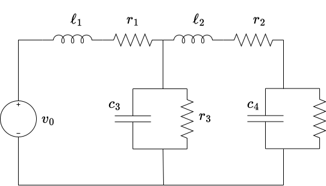

Examples of port-controlled Hamiltonian Systems
## RLC circuit

Any electrical circuit composed of linear elements such as capacitances, inductances and resistances, can be represented as a port-controlled Hamiltonian system.  Consider the following circuit:

We define state variables as $$x_1=\ell_1i_1$$, $$x_2=\ell_2i_2$$, $$x_3 = c_3 v_3$$ and, $$x_4=c_4v_4$$ and a Hamiltonian:

$H(x) = \frac{1}{2\ell_1}x_1^2 + \frac{1}{2\ell_2}x_2^2 + \frac{1}{2c_3}x_3^2 + \frac{1}{2c_4}x_4^2$, 

Then,

$\nabla H = \left(\begin{array}{c} x_1/\ell_1 \\ x_2/\ell_2 \\ x_3/c_3 \\ x_4/c_4\end{array}\right)$

A square matrix $Q$ is defined as follows:

$Q=\text{diag}\left(\frac{1}{\ell_1},\; \frac{1}{\ell_2},\;\frac{1}{c_3},\; \frac{1}{c_4}\right)$

Then, $H$ can be written in a more compact representation: 

$H(x) = \frac{1}{2}x^\top Q x$

and,

$\nabla H(x) = Qx$

The dynmamic model can be obtained by using Kirchhoff current and voltage laws, for instance:

$i_1 = i_2 + i_3$, is equivalent to: ${x_1}/{\ell_1} = {x_2}/{\ell_2} + {x_3}/{(c_3r_3)}+ \dot{x}_3$

$i_2 = i_4$, is equivalent to: ${x_2}/{\ell_2} = {x_4}/{(c_4r_4)}+ \dot{x}_4$

$v_0 = v_1 + v_3$, is equivalent to: $v_0 = {r_1x_1}/{\ell_1} + \dot{x}_1 + {x_3}/{c_3}$

and, finally:

$v_3 = v_2 + v_4$, is equivalent to: $x_3/c_3 = {r_2x_2}/{\ell_2} + \dot{x}_2 + x_4/c_4$

Reorganizing the equations, we obtain a PCHS with input $u=v_0$, and:

$R = \text{diag}(r_1,\; r_2,\; 1/r_3,\; 1/r_4)$

$J = [ 0 \; 0 \; -1 \; 0 ; 0 \; 0 \; 1 \; -1 ; 1 \; -1 \; 0 \; 0 ; 0 \; 1 \; 0 \; 0 ]$

$G = [ 1 ;  0  ;  0  ;  0 ]$

Simulating this circuit in JuPCHS is quite simple, suppose that the resistances are $r_1 = 1$, $r_2 = 5$, $r_3 = 50$, $r_4 = 2$; and the inductances/capacitances are $\ell_1 = 1.3\times 10^{-3}$, 
$\ell_2 = 1.5\times 10^{-3}$, $c_3 = 200\times 10^{-6}$ and, 
$c_4 = 300\times 10^{-6}$. Then the PCHS is build as follows:

    using LinearAlgebra
    include("scr/JuPCHS.jl")
    using .JuPCHS
    R = diagm([1,5,1/50,1/2])
    Q = diagm([1/1.3E-3,1/1.5E-3,1/200E-6,1/300E-6])
    J = [0 0 -1 0; 0 0 1 -1; 1 -1 0 0; 0 1 0 0]
    G = [1;0;0;0]
    CIRCUIT = BuildPCHS(nx=4,nu=1,H=Q,J=J,R=R,G=G,dt=1E-5)
    println(CIRCUIT)

Notice the function create automatically H and dH from the matrix $Q$.   A simulation for input $v_0=1200$ is obtained below:

    results = Simulate(PCHS=CIRCUIT, u=[20])
    PlotResults(PCHS=CIRCUIT,data=results)

---

Return to: [List of examples](CH05.md)
