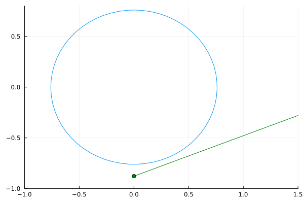

# Principio de estabilidad de La Salle en un sistema discreto

* L. F. C. Alberto, T. R. Calliero and A. C. P. Martins, "An Invariance Principle for Nonlinear Discrete Autonomous Dynamical Systems," in IEEE Transactions on Automatic Control, vol. 52, no. 4, pp. 692-697, April 2007, doi: 10.1109/TAC.2007.894532

---
## Contacto

Alejandro Garcés Ruiz
(https://github.com/alejandrogarces)

## Licencia

